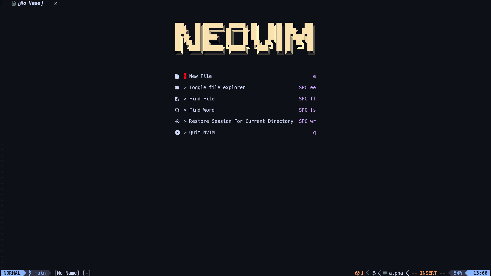
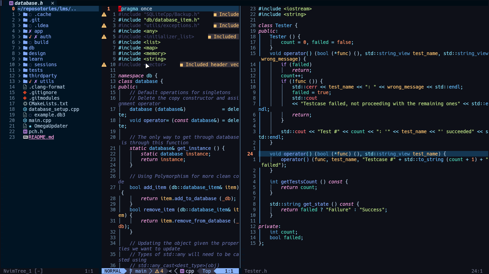

# Screenshots

**Dashboard**


**Working on a C++ project**


# The Story

I have been familiar with VIM motions for almost 6 months now, using them daily in all the IDEs; however, It was about time I change fully to neovim. I have tried the distrubtion of [NvChad](https://nvchad.com/) with some dotfiles online to support the _clangd_ language server and _nvim-dap_ for debugging my **C++** projects

Recently, I have decided to work on my own custom config to wrap my head more around the ecosystem of neovim.

These dotfiles are inspired by [Josean Martinez](https://github.com/josean-dev) in addition to [LazyVim](http://www.lazyvim.org/) configurations and plugins

# Prequisities

1. Having [**ripgrep**](https://github.com/BurntSushi/ripgrep) installed

   This is important for **telescope** to work efficiently

2. [**Nerd font**](https://www.nerdfonts.com/) as your terminal font
3. **Lazy git** to work with the plugin **lazy-git**

# Installation

## Linux / Macos

1. Backing up your config

```sh
# required
mv ~/.config/nvim{,.bak}

# optional but recommended
mv ~/.local/share/nvim{,.bak}
mv ~/.local/state/nvim{,.bak}
mv ~/.cache/nvim{,.bak}
```

2. Cloning the repo

```sh
# Clone the repo
git clone https://github.com/omardoescode/nvim-dotfiles ~/.config/nvim

# remove the git folder (optional)
rm -rf /.config/nvim/.git # remove the git folder (optional)

# start your journey
nvim
```

After installing, run the `:MasonInstallAll` command after lazy.nvim finishes downloading plugins

## Windows

1. Backing up your config

```sh
# required
Move-Item $env:LOCALAPPDATA\nvim $env:LOCALAPPDATA\nvim.bak

# optional but recommended
Move-Item $env:LOCALAPPDATA\nvim-data $env:LOCALAPPDATA\nvim-data.bak
```

2. Cloning the repo

```sh
# Clone the repo
git clone https://github.com/omardoescode/nvim-dotfiles $env:LOCALAPPDATA\nvim

# remove the git folder (optional)
Remove-Item $env:LOCALAPPDATA\nvim\.git -Recurse -Force

# Start your journey
nvim
```

# Todo

- [x] Use the plugin Harpoon2 Made by the great (ThePrimeagen)[https://www.youtube.com/c/theprimeagen]
- [x] Create random headers for the dashboard
- [x] Install an AI assistant (Codeium)
- [ ] Learn how to use quickfix lists in a real project (& (folke/trouble.nvim))
- [ ] Add a special handler for clangd

  It has to support clang-tidy as well

- [ ] Install a debugger on neovim
- [ ] Install a plugin to take aesthetic screenshots of code
- [ ] create obsidian callouts snippets in neovim
- [ ] **Most Importantly**, escape the hell of neovim config. It's about coding after all

  I will just work on adding more themes and more support on this config as I need. Maybe I will change this after a minimum of 6 months

# Contact Me

1. [Linkedin](https://www.linkedin.com/in/omardoescode/)
2. [Github](https://www.github.com/omardoescode/)
